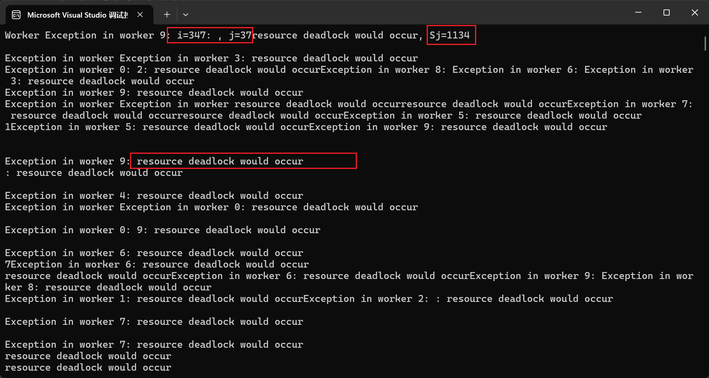
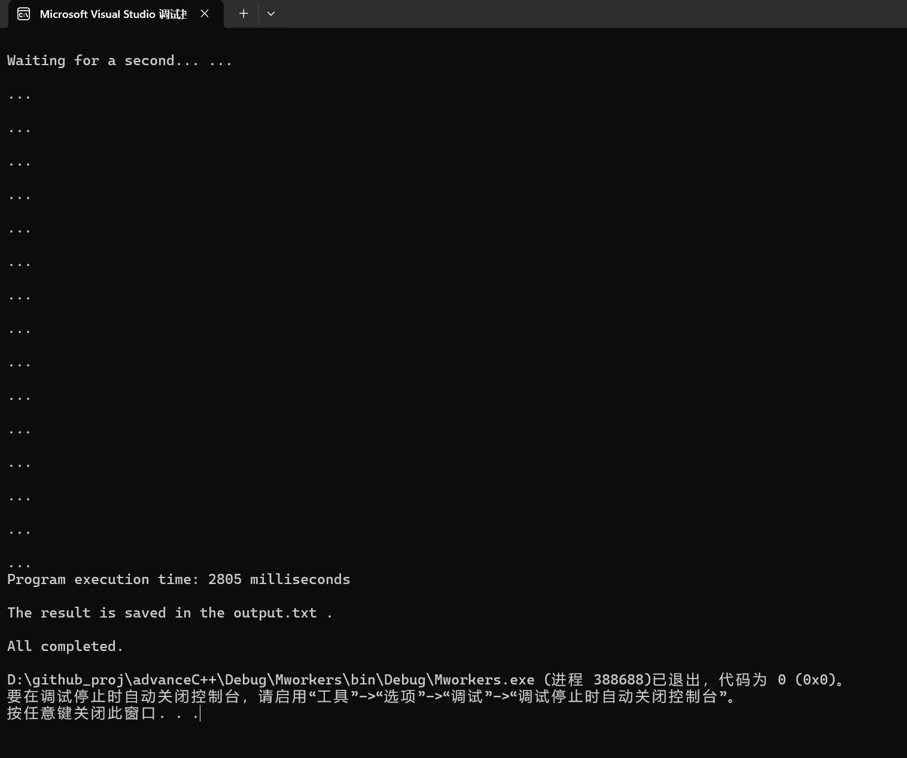
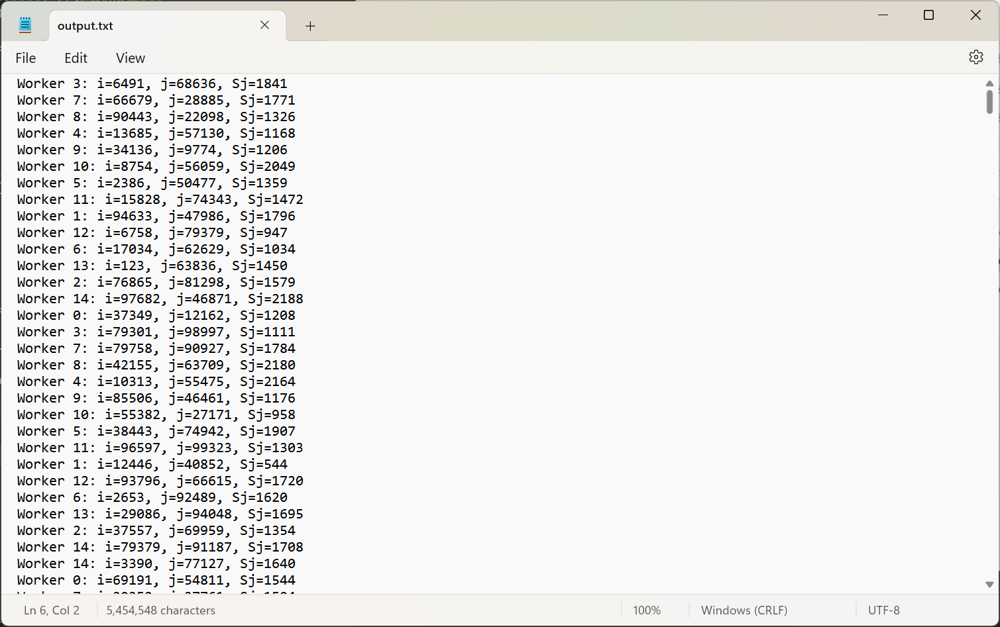

# Mworkers
一个C++多线程应聘笔试项目

```cpp
Question. 
Given an integer array S of length N (N = 100,000), there are M (M >= 2) workers concurrently accessing and updating S. 

Each worker repeats the following operation 10,000 times: Generate random numbers i and j, 0 <= i, j < 100,000. 
Update S such that S(j) = S(i) + S(i+1) + S(i+2). 
If i + 1 or i + 2 is out of bounds, then use (i+1) % N or (i+2) % N. 

Hint: 
(a) Please consider concurrent protection, i.e., reading S(i), S(i+1), S(i+2) and updating S(j) are atomic operations. 
*Refer to the two-phase locking algorithm 
(b) Pay attention to the lock granularity. 
Each worker only reads 3 elements at a time and writes 1 element. 
There are a total of 100,000 elements. The probability that concurrent workers access the same element is very low. 
Using fine-grained locks can reduce conflicts and improve concurrency. 
(c) Pay attention to the difference between read locks and write locks. 
(d) j may fall in the [i, i+2] range. 
(e) Additional thinking: Will deadlock occur? How to avoid?
```

每个工人完成的工作并不复杂。因此重点考虑锁的粒度设计：

1. 工人A读取数据 Si Si+1 si+2 的时候，别的工人是不能够对A正在读取的数据进行修改的，但是可以上共享锁，可以读取数据。

2. 工人A写入数据 Sj 的时候，别的工人是不允许读取和写入的，因此上互斥锁。

3. 由于 j 可能落在区间 [i, i+2] 中，如果先上 [i, i+2] 的共享锁，就会出现 j 的互斥锁无法上锁。因此先上 j 的互斥锁，再上 [i, i+2] 的共享锁。
[i, i+2]上锁的时候，要特判一下，如果 j 已经上锁了，就跳过该元素的共享锁操作。
(及难过实践之后发现，这个方法在多线程下会出错，编译器会认为可能会发生死锁而抛出异常。最好排序后上锁)。

4. j 上完互斥锁之后，别的线程若试图申请 j 锁，就会阻塞。

5. A 将 j 上完互斥锁之后，分别要申请 [i, i+2] 的共享锁。而在同一时刻，B 申请到了 i 的互斥锁。
若 B 试图申请 j 的共享锁，就会阻塞。若 A 试图申请 i 的共享锁，就会阻塞。此时发生死锁。
解决的最好的办法，就是一次性必须保证四个锁能全部申请到，如果有一个锁申请失败，就直接释放已经申请到的所有锁资源。然后再次重新申请。

6. 一个工人同一个时间段里面只能专注于一次操作，因此分配给这个工人的其他任务就要被阻塞。也就是说，同一时间内，最多只有M个工人（线程）在操作。
因此，每个工人视作一个线程，线程里面重复地进行工作。每一次工作的内容都是重复的上锁和读写操作。

7. 两段锁协议。在操作之前就把所有需要申请的锁都申请了，然后操作结束后再释放锁。


旧版本的worker.cpp 会发生死锁，逻辑上感觉没问题，但是会抛出异常说可能会发生死锁。
如图：
可能是`j, i, (i + 1) % N, (i + 2) % N`四个元素的上锁顺序太混乱导致编译器警告可能会发生死锁。
```cpp
//每一个工人的工作都是一个线程
#include "locks.h"
#include <iostream>
#include <mutex>
#include <shared_mutex>
#include <set>

// 定义一个全局的互斥锁，用于保护std::cout的访问
std::mutex cout_mutex;

void worker(int workerId, Locks& locks, int times, int N)
{
	//随机数
	std::random_device rd;
	std::mt19937 gen(rd());
	std::uniform_int_distribution<> dist(0, N - 1);

	for (int t = 0; t < times; t++)
	{
		try
		{
			int i = dist(gen);
			int j = dist(gen);

			//收集所有需要锁定的索引
			std::set<int> indicates = { j, i, (i + 1) % N, (i + 2) % N };

			// 尝试获取写锁（unique_lock）和读锁（shared_lock）
			// 写锁 j 延迟上锁, 只是先封装对象
			std::unique_lock<std::shared_mutex> lock_j(locks.getSharedMutex(j), std::defer_lock);
			std::vector<std::shared_lock<std::shared_mutex>> lock_is;//读锁数组

			bool all_locked = false; //最开始都没有上锁

			while (all_locked == false) //只要不是全部都成功上锁
			{
				all_locked = true;

				if (lock_j.try_lock()) //写锁 j 上锁成功
				{
					for (int idx : indicates) //遍历候选项，将不为 j 的索引上读锁
					{
						if (idx != j)
						{
							lock_is.emplace_back(locks.getSharedMutex(idx));
							if (!lock_is.back().try_lock()) //只要任何一个读锁申请失败
							{
								all_locked = false;

								//释放已经获取的读锁
								for (auto& lock : lock_is)
								{
									if (lock.owns_lock())
									{
										lock.unlock();
									}
								}
								lock_is.clear();
								//释放写锁
								lock_j.unlock();
								break;
							}
						}
					}
					if (all_locked == false) //如果没有全部上锁成功，就重试
					{
						std::this_thread::yield(); // 让出CPU，避免忙等待
					}
				}
			}

			//跳出循环证明获得所有锁
			int sum = locks.getS(i) + locks.getS((i + 1) % N) + locks.getS((i + 2) % N);
			locks.setS(j, sum);

			// 使用互斥锁保护std::cout的访问
			std::lock_guard<std::mutex> lock(cout_mutex);
			std::cout << "Worker " << workerId << ": i=" << i << ", j=" << j << ", Sj=" << sum << std::endl;

			// 所有锁在超出作用域时自动释放
			// 下一次循环会重新申请锁
		}
		catch (const std::exception& e)
		{
			std::cerr << "Exception in worker " << workerId << ": " << e.what() << std::endl;
		}
	}
}

```

解决的办法就是排序后按照顺序进行上锁操作。

Ac
```cpp
//每一个工人的工作都是一个线程
#include "locks.h"
#include <iostream>
#include <mutex>
#include <shared_mutex>
#include <set>
#include <fstream>

// 定义一个全局的互斥锁，用于保护std::cout的访问
std::mutex cout_mutex;

// 定义一个全局的文件输出流
std::ofstream output_file;


void worker(int workerId, Locks& locks, int times, int N)
{
	//随机数
	std::random_device rd;
	std::mt19937 gen(rd());
	std::uniform_int_distribution<> dist(0, N - 1);

	for (int t = 0; t < times; t++)
	{
		try
		{
			int i = dist(gen);
			int j = dist(gen);

			//收集所有需要锁定的索引
			std::set<int> indicates = { j, i, (i + 1) % N, (i + 2) % N };
			std::vector<int> sortedIndicates(indicates.begin(), indicates.end());
			std::sort(sortedIndicates.begin(), sortedIndicates.end()); //按照索引的大小来进行上锁


			std::vector<std::unique_lock<std::shared_mutex>> lock_j; //写锁
			std::vector<std::shared_lock<std::shared_mutex>> lock_is;//读锁数组

			bool all_locked = false; //最开始都没有上锁

			while (all_locked == false) //只要不是全部都成功上锁
			{
				all_locked = true;
				lock_j.clear();
				lock_is.clear();

				for (int idx : sortedIndicates)
				{
					if (idx == j)
					{
						lock_j.emplace_back(locks.getSharedMutex(idx), std::defer_lock);
						if (!lock_j.back().try_lock()) //写锁没有成功
						{
							all_locked = false;
							break;
						}
					}
					else
					{
						lock_is.emplace_back(locks.getSharedMutex(idx), std::defer_lock);
						if (!lock_is.back().try_lock()) //读锁有一个没有成功
						{
							all_locked = false;
							break;
						}
					}
				}

				if (!all_locked)
				{
					// 释放已获取的锁
					for (auto& lock : lock_j)
					{
						if (lock.owns_lock())
						{
							lock.unlock();
						}
					}
					for (auto& lock : lock_is)
					{
						if (lock.owns_lock())
						{
							lock.unlock();
						}
					}
					std::this_thread::yield();
				}
			}

			//跳出循环证明获得所有锁
			int sum = locks.getS(i) + locks.getS((i + 1) % N) + locks.getS((i + 2) % N);
			locks.setS(j, sum);

			// 使用互斥锁保护std::cout的访问
			std::lock_guard<std::mutex> lock(cout_mutex);
			//std::cout << "Worker " << workerId << ": i=" << i << ", j=" << j << ", Sj=" << sum << std::endl;
			// 同时将输出写入文件
            if (output_file.is_open()) 
			{
                output_file << "Worker " << workerId << ": i=" << i << ", j=" << j << ", Sj=" << sum << std::endl;
                output_file.flush(); // 确保立即写入文件
            }

			// 释放所有锁
			for (auto& lock : lock_j)
			{
				if (lock.owns_lock())
				{
					lock.unlock();
				}
			}
			for (auto& lock : lock_is)
			{
				if (lock.owns_lock())
				{
					lock.unlock();
				}
			}
		}
		catch (const std::exception& e)
		{
			std::lock_guard<std::mutex> lock(cout_mutex);
			output_file << "Exception in worker " << workerId << ": " << e.what() << std::endl;
			output_file.flush(); // 确保立即写入文件
		}
	}
}

```

测试结果：




项目使用`cmake`构建。`srcCode`目录下面是源（头）文件和测试结果输出文件`output.txt`。
`img`文件夹下放了测试结果的图片，也做图床。

开始时间2025.5.3   
完成时间2025.5.3